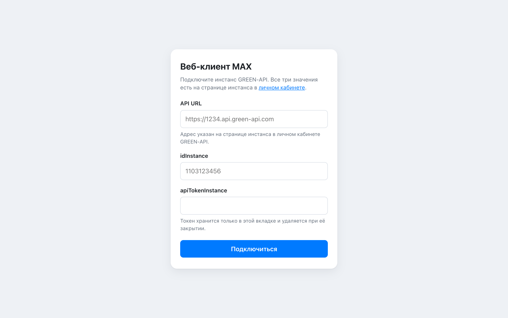
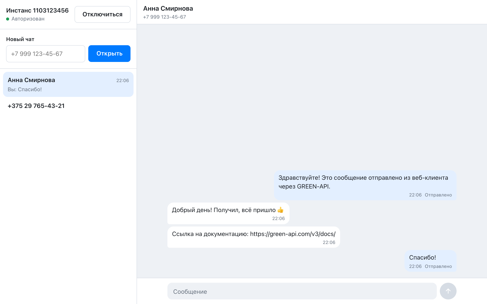
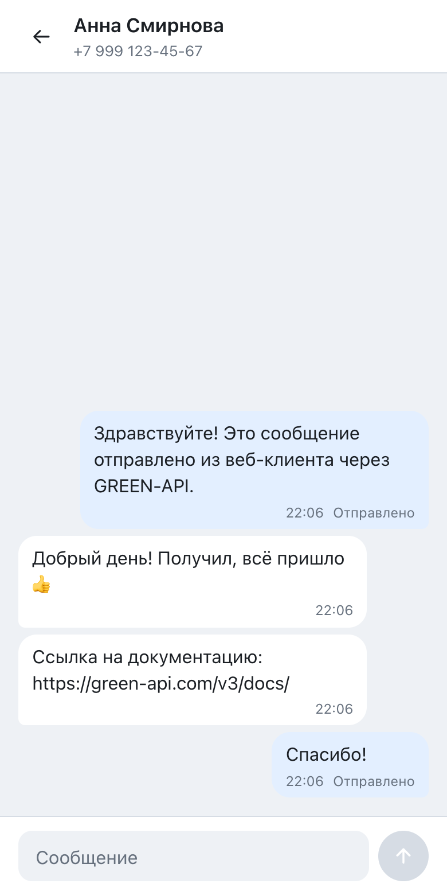

# Веб-клиент MAX на GREEN-API

Чат для мессенджера MAX в браузере. Подключаете свой инстанс [GREEN-API](https://green-api.com/v3/docs/),
вводите номер получателя, отправляете текст и получаете ответы. Внешний вид повторяет web.max.ru.
Только текстовые сообщения.

Демо: https://green-api-beryl.vercel.app/

| Подключение                      | Чат                           | Мобильная версия                          |
| -------------------------------- | ----------------------------- | ----------------------------------------- |
|  |  |  |

## Запуск

Нужен Node.js `^20.19` или `>=22.12` (см. `.nvmrc`).

```bash
npm ci
npm run dev        # http://localhost:5173
```

Production-сборка:

```bash
npm run build
npm run preview    # http://localhost:4173
```

Переменных окружения нет: всё вводится в интерфейсе.

## Инстанс GREEN-API

1. Создайте инстанс MAX в [личном кабинете](https://console.green-api.com) и авторизуйте его по
   QR-коду из приложения MAX.
2. На странице инстанса в личном кабинете есть три значения, их нужно ввести в приложении:
   `apiUrl` (адрес вида `https://1234.api.green-api.com`), `idInstance` и `apiTokenInstance`.
   `apiUrl` у разных инстансов разный, поэтому его нужно скопировать, а не набирать по примеру.
3. В настройках инстанса:
   - **Webhook URL пустой.** Иначе `ReceiveNotification` не работает. Приложение не даст
     подключиться и объяснит почему.
   - **«Получать уведомления о входящих сообщениях» включено.** Без этого ответы не придут.
   - **«Получать уведомления о статусах сообщений» включено** (желательно). Без этого приложение
     не узнает о недоставленных сообщениях и покажет предупреждение.

Приложение настройки только читает. Менять их через `SetSettings` не стоит: инстанс
перезапускается.

Для проверки нужен второй аккаунт MAX на российском (+7) или белорусском (+375) номере:
`CheckAccount` принимает только их.

## Как это работает

Приложение обращается к GREEN-API напрямую из браузера, без своего бэкенда.

**Подключение.** `getStateInstance` и `getSettings` проверяют, что инстанс авторизован и настроен
на приём через HTTP API.

**Новый чат.** Номер нормализуется (российский и белорусский форматы, включая `8 …`), затем
`CheckAccount` возвращает chatId. Чат всегда открывается под этим chatId.

**Отправка.** Сообщение сразу появляется как «Отправляется», поле ввода очищается, и идёт
`SendMessage`. Несколько отправок идут параллельно, каждая обновляет только своё сообщение.
Неудачное можно повторить на том же месте.

**Приём.** Пока вы подключены, работает один цикл:

```
ReceiveNotification (receiveTimeout = 20 с)
  → разобрать уведомление
  → применить событие
  → DeleteNotification(receiptId)
  → снова
```

В каждый момент идёт не больше одного запроса. Если очередь пуста и сервер ответил быстрее
секунды, цикл делает паузу. При сетевых ошибках повторы идут с задержкой до 15 с. Неверный токен,
неизвестный инстанс или заданный Webhook URL останавливают приём и возвращают на экран
подключения.

## Ключевые решения

- **chatId только из `CheckAccount`.** Если отправлять на `телефон@c.us`, ответы приходят под
  другим id и не попадают в чат.
- **Удаляется каждое полученное уведомление**, даже неподдерживаемое или повреждённое. Очередь
  FIFO: оставленное уведомление заблокирует всё, что за ним.
- **Повторная обработка безопасна.** Если удаление не удалось, то же уведомление придёт снова,
  а дубликаты игнорируются.
- **Локальный id сообщения отдельно от id сервера.** Повтор сохраняет позицию сообщения, а
  статус «не доставлено» применяется только к той попытке, к которой относится.
- **`sessionStorage` вместо `localStorage`.** Учётные данные и чаты переживают перезагрузку, но
  исчезают при закрытии вкладки.
- **Без бэкенда и без библиотек состояния.** CORS у GREEN-API открыт, а токен пользователь
  вводит сам: прокси его не скрыл бы. Состояние хранится в `useReducer` и передаётся через props.
- **Ответы API проверяются через zod** на границе с API, чтобы неожиданные данные не попали в
  состояние.

Код разделён на слои. В `chat/` лежат модель и редьюсер без React, в `green-api/` вся работа с
API, в `connection/` и `workspace/` хуки и компоненты, в `ui/` общие компоненты.

## Ограничения

- **Только чаты, открытые в этой сессии.** Сообщения из других чатов удаляются из очереди и не
  показываются.
- **Очередь разбирается при подключении.** GREEN-API хранит уведомления 24 часа; всё
  накопленное будет получено и удалено сразу после подключения.
- **Чаты привязаны к инстансу.** После подключения к другому инстансу старые чаты не
  показываются.
- **Отправка, прерванная перезагрузкой, становится «Отправка не подтверждена».** Сообщение
  могло уйти, поэтому автоматически оно не повторяется; повторить можно вручную.
- **Одна вкладка на инстанс.** Две вкладки или два приложения делят одну очередь, и каждое
  видит только часть сообщений.
- **Лимит тарифа.** Уведомление об исчерпанной месячной квоте остаётся до перезагрузки страницы
  или отключения.
- **История только за сессию**, старые переписки не загружаются.
- **Токен виден в браузере.** Он хранится только в `sessionStorage` и приложением не
  логируется, но входит в URL запросов. Поэтому он виден в DevTools, а браузер показывает
  его в консоли, если запрос завершился ошибкой.

## Деплой

Статический сайт. На Vercel:

```bash
npx vercel deploy --prod
```

`vercel.json` задаёт Content Security Policy (без `eval` и inline-скриптов), `Referrer-Policy` и
`X-Content-Type-Options`.

## Проверки

```bash
npm run lint
npm run typecheck
npm run format:check
npm test
npm run build
```

Те же проверки запускает CI на каждый push и pull request. Тесты не обращаются к реальному API:
клиент проверяется на подменённом `fetch` с примерами ответов из документации GREEN-API.
